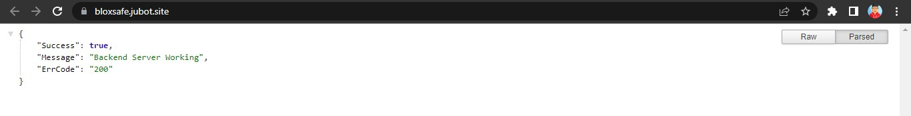

# BloxSafe

**[IN DEVELOPMENT]**. 🚀 Dashboard to manage your Roblox scripts. Live preview at [https://bs.jubot.site/](https://bs.jubot.site/).

```yaml
Username: demo
Password: demo
```

## Features

- 5 Themes
- Key System
- Script Obfuscation
- Script Minification
- Premade Custom Script Hub
- Discord Webhook Integration

## Installation

- **[Frontend Installation](/Client/README.md)**
- **[Backend Installation](/Backend/README.MD)**
- **[DigitalOcean Installation(BEST)](/VPS_INSTALLATION.MD)**

## Preview




## License

The **[LICENSE](./LICENSE)** applys to every aspect of this project including images, backend code & frontend code. Also, paid distribution and commercial use is strictly prohibited. Anyone can use this "software" as far they are permitted, The owner/developer of this project has the full right to provoke your right to use this "software" at any time. In simple terms you can host this "software" and allow others to use off your hosting as far you don't remove watermarks and give proper credit.

## Contribution

BloxSafe is open to contributions. You can send a [Pull Requests](https://github.com/jareer12/BloxSafe/pulls) or open an [Issue](https://github.com/jareer12/BloxSafe/issues) if you find bugs, typos or errors. You can find me on my [Discord server](https://discord.gg/M6bn9xtrhC).
